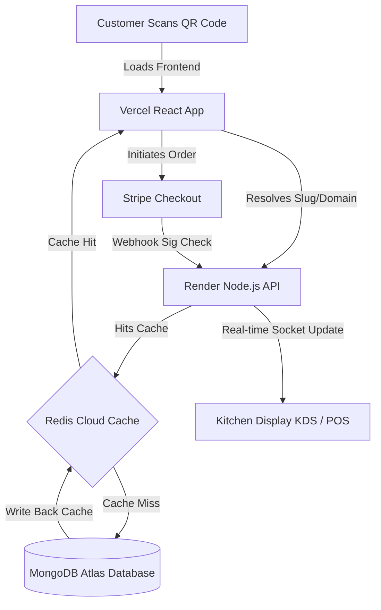

# 🍽️ Ultimate Restaurant SaaS Platform

A production-ready, highly scalable, multi-tenant Restaurant Management System (SaaS) built using the MERN stack (MongoDB, Express, React, Node.js), powered by **Redis Cloud Caching**, **Stripe Subscription Billing**, and secured with **HttpOnly Cookies**.

This platform enables multiple restaurant tenants to manage their operations (POS, KDS, staff, tables, inventory, deliveries, and loyalty programs) in a single-instance SaaS architecture where data is strictly isolated.

---

## 🏗️ Architecture & Core Design

### Multi-Tenancy Strategy
* **Logical Database Isolation**: Every document (orders, users, menu items, etc.) is scoped with a `restaurantId` referencing the `Tenant` model.
* **Database Indexes**: High-performance indexes are created on `{ restaurantId: 1, ... }` to ensure extremely fast queries and enforce unique scoped constraints (e.g. unique staff emails *per restaurant*).
* **Fault-Tolerant Redis Caching**: Public menus, categories, and deals are cached in Redis namespace groups (e.g., `menu:categories:${restaurantId}`). If Redis goes offline, the system automatically falls back to MongoDB Atlas seamlessly.
* **XSS & Session Security**: Authentication uses a stateless JWT system written directly to **HttpOnly, Secure, SameSite: None/Lax cookies** to eliminate local/session storage token theft vulnerabilities.



---

## 📁 System Modules

```
├── client/                     # React Frontend (Vite)
│   ├── src/
│   │   ├── components/         # Shared layouts, UI, and common widgets
│   │   ├── context/            # AuthContext (cookie-based state validation)
│   │   ├── lib/                # API Base constants and roles lookup
│   │   └── pages/              # Role-specific modules (Admin, Customer, Driver, Kitchen, Waiter, SuperAdmin)
│   └── vercel.json             # Single-Page App (SPA) rewrite rules
└── server/                     # Node.js Express Backend
    ├── middlewares/            # Maintenance, auth check, and role guards
    ├── modules/                # Feature modules (User, Tenant, Menu, Table, Payment, Order, Inventory)
    └── utils/                  # Redis, DB connections, API response formats
```

### 1. User & Staff Management (RBAC)
* Single unified collection utilizing Role-Based Access Control (RBAC).
* **Roles**:
  * `SuperAdmin`: Manages plans, platform stats, and approves/suspends restaurants.
  * `Admin`: The restaurant owner. Manages settings, staff accounts, menu setup, and billing.
  * `Manager`: Handles day-to-day operations (POS orders, inventory, reservations).
  * `Chef`: Operational access to the Kitchen Display System (KDS).
  * `Waiter`: Front-of-house table reservations and POS logging.
  * `Driver`: Map routing and delivery dispatches.
  * `Customer`: Self-checkout, review boards, and loyalty program tracking.

### 2. Menu & Catalog Management
* Nested categories with custom scheduling (e.g., *Breakfast 09:00 - 12:00*).
* Optional modifiers, dietary labels, allergen tags, and nutritional tracking.
* Automated cache invalidation triggers whenever an Admin adds, updates, or deletes menu items.

### 3. POS, Tables & reservations
* Dynamic floor mapping (X/Y coordinates, shape, and capacity).
* Unique **QR code generation** per table for instant, frictionless table-side customer checkout.
* Reservation portal with status tracking (Available, Occupied, NeedsCleaning).

### 4. Kitchen Display System (KDS)
* Real-time preparation pipeline.
* Kanban-board styling for chefs to update statuses from *Pending* -> *Preparing* -> *Ready* -> *Served*.

### 5. Inventory & Auto-Deduction
* Real-time stock counts with unit configurations.
* Recipe linkages: automatic ingredient stock deduction whenever an order completes.
* Threshold low-stock email triggers.

### 6. Delivery Dispatch & Zones
* Delivery polygons (GeoJSON) and radius zones.
* Real-time GPS location coordinates transmission for active drivers.

---

## 🚀 Local Development Setup

### Prerequisites
* [Node.js](https://nodejs.org/) (v18+)
* [MongoDB](https://www.mongodb.com/) (Local or Atlas Cluster)
* [Redis](https://redis.io/) (Local or Redis Cloud)
* [Stripe CLI](https://stripe.com/docs/stripe-cli) (For testing webhook callbacks)

### 1. Clone the project and install dependencies
```bash
# Install backend dependencies
npm install

# Install frontend dependencies
cd client
npm install
cd ..
```

### 2. Configure Environment Variables
Create a `.env` file in the **root project directory**:
```env
PORT=5000
NODE_ENV=development

# Database URIs
MONGO_URI=your_mongodb_connection_string
ENABLE_REDIS=true
REDIS_URL=your_redis_connection_string

# JWT Session config
JWT_SECRET=your_jwt_secret_signature_key
JWT_EXPIRES_IN=7d

# Stripe Payment settings
STRIPE_SECRET_KEY=sk_test_...
STRIPE_PRO_PRICE_ID=price_...
STRIPE_ENT_PRICE_ID=price_...
STRIPE_WEBHOOK_SECRET=whsec_...

# Frontend Dynamic Configuration
VITE_API_BASE=http://localhost:5000/api/v1
VITE_STRIPE_PUBLISHABLE_KEY=pk_test_...
```

### 3. Run the App
```bash
# Start backend API (from root folder)
npm run dev

# Start frontend application (from client folder)
cd client
npm run dev
```

---

## ☁️ Production Deployment

### 1. Backend Server Deployment (Render)
Deploy the root repository as a **Web Service** on Render:
* **Runtime**: `Node`
* **Build Command**: `npm install`
* **Start Command**: `npm start`
* **Environment Variables**: Add your production MongoDB, Redis, JWT, and Stripe secret keys. Make sure `NODE_ENV` is set to `production`.

### 2. Frontend App Deployment (Vercel)
Deploy your repository on Vercel:
* **Root Directory**: Set to **`client`** (This triggers Vercel's automated Vite configuration).
* **Environment Variables**:
  * `VITE_API_BASE` = `https://your-render-api.onrender.com/api/v1`
  * `VITE_STRIPE_PUBLISHABLE_KEY` = `pk_live_your_stripe_publishable_key`
* **SPA Routing**: The custom `client/vercel.json` rewrite configuration automatically fallback-routes direct URLs (like `/r/cheezious`) to `/index.html` to prevent 404 errors.

---

## 🔒 Security Design Highlights
1. **CSRF & XSS Mitigation**: JWT tokens are placed in `HttpOnly` cookies. JavaScript running on client browsers cannot read these tokens.
2. **Flexible CORS Policy**:
   ```javascript
   // Automatically whitelists localhost and dynamic Vercel deployments
   const isAllowed = allowedOrigins.includes(origin) || origin.endsWith('.vercel.app');
   ```
3. **Cryptographic Signatures**: All incoming Stripe checkout payment notifications are cryptographically verified using the Stripe Webhook signature verification secret before updating order data in Mongoose.
